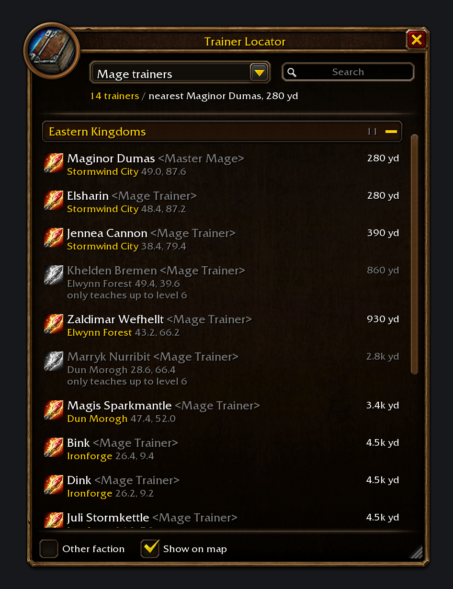

# Trainer Locator

A WoW: Forever addon that shows where every trainer is: class trainers, weapon masters, profession
and secondary-skill trainers, riding, pet and portal trainers. Pick a kind and it lists every one in
the world, nearest first, grouped by continent. Click one to put the game's map pin on them.

- `/trainers` (or `/tl`) opens the window. The minimap's addon menu and a key binding (Options >
  Keybindings > AddOns) open it too.
- `/trainers alchemy`, `/trainers mage` or `/trainers weapon` opens it on that kind. Anything else
  searches every trainer by name, title or zone: `/trainers ironforge`.
- It starts on your class's trainers. Distances follow you as you walk.
- Click a trainer to put the map pin on them. That also tracks it, so the arrow shows in the world,
  and opens the map there. Shift-click links the spot in chat. Right-click clears the pin.
  TomTom gets a waypoint too when it's installed.
- Rows go grey when a trainer can't help you: a starting-area class trainer whose spells stop below
  your level, or a profession trainer who can't take you past your current rank.
- **Show on map** marks the list's trainers on zone and city maps. Hover a pin for the details,
  click it for the map pin.
- **Other faction** also lists trainers who won't talk to you, greyed out.
- Options > AddOns > Trainer Locator has the settings and the window scale.

## Data

`TrainerLocator/Data.lua` is generated. To refresh it:

1. `python3 tools/recv.py` (a localhost bridge the browser hands the scrape to)
2. Open <https://www.wowhead.com/forever/npcs?filter=28;1;0>, paste `tools/scrape_wowhead.js` into the
   developer console and let it run (an hour or so; Wowhead throttles it)
3. `python3 tools/build_data.py`

Wowhead lists some maps' NPCs twice: where they stand, and that spot projected onto a
different-sized map of the same place. `build_data.py` keeps the spot that matches the NPC's vanilla
spawn from the cMaNGOS classic database, placed with Forever's own map bounds
(`tools/extract_cmangos.py` makes `tools/data/cmangos_trainers.json`). It uses the offset those pairs
reveal to clear the copies off Forever's new NPCs.

## Tests and previews

```
python3 -m venv /tmp/wowlua && /tmp/wowlua/bin/pip install lupa pillow
/tmp/wowlua/bin/python tools/test/run.py
/tmp/wowlua/bin/python tools/test/preview.py list out.png
/tmp/wowlua/bin/python tools/test/mapview.py 1453 class:MAGE map.png
/tmp/wowlua/bin/python tools/test/verify_atlases.py
```

`run.py` runs the addon in Lua 5.1 against a mock of Forever's API, with the real map tables.
`preview.py` draws the window with the game's own art and font. `mapview.py` draws a world map
with the pins, to check spots against the buildings they belong in.

## Install

`sh tools/install.sh` copies it to the WoW: Forever beta client on macOS. A new addon needs a game
restart. Updates just need a `/reload`.


